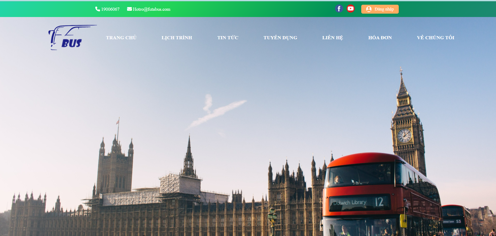
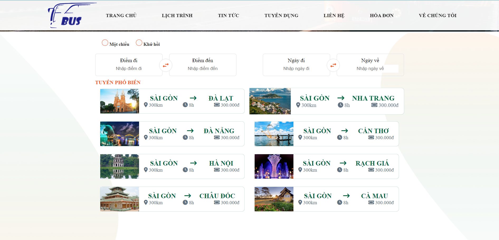
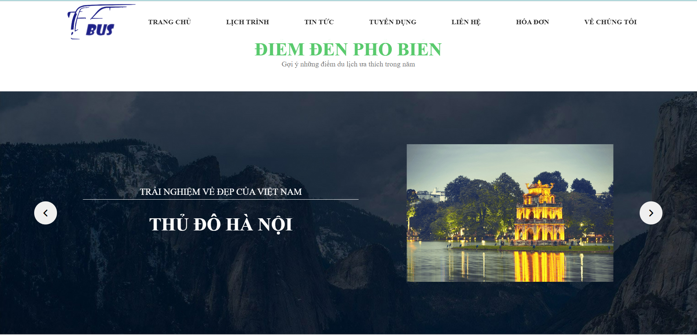
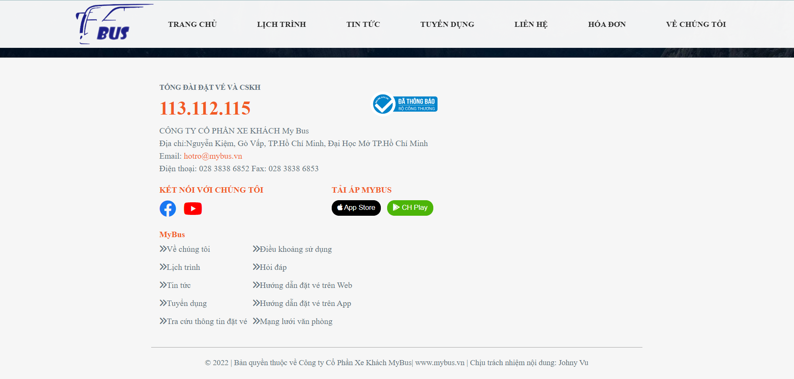
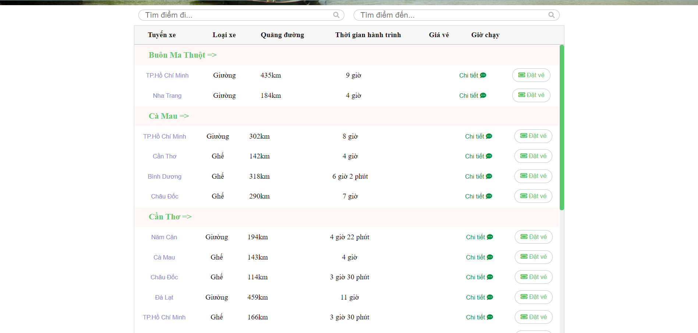
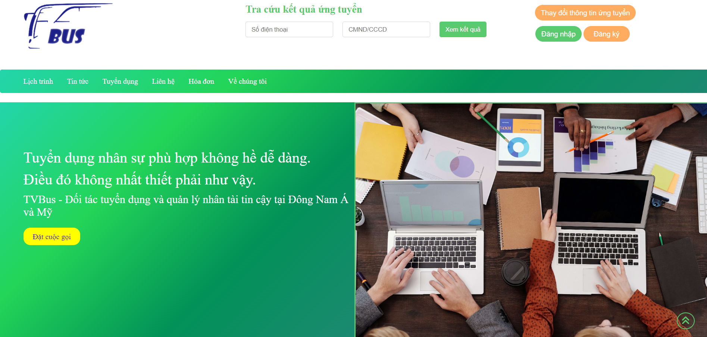
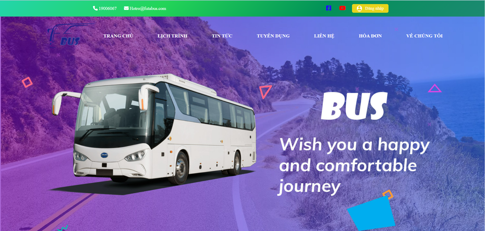
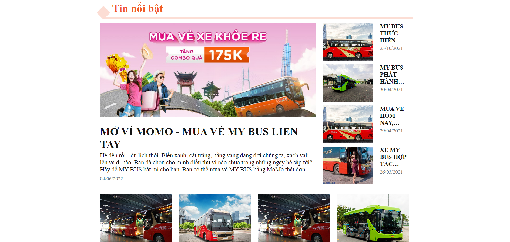

# Bus-Website
Project này xây dựng giao của 1 trang bán vé xe khách với ngôn ngữ : HTML, CSS, JS, React

# Giao diện trang chủ
</img>
</img>
</img>
</img>
</img>

# Giao diện lịch trình
</img>
</img>

# Giao diện lịch trình
</img>
</img>

# Giao diện lịch trình
</img>
</img>

# Giao diện tin tức
</img>
</img>
